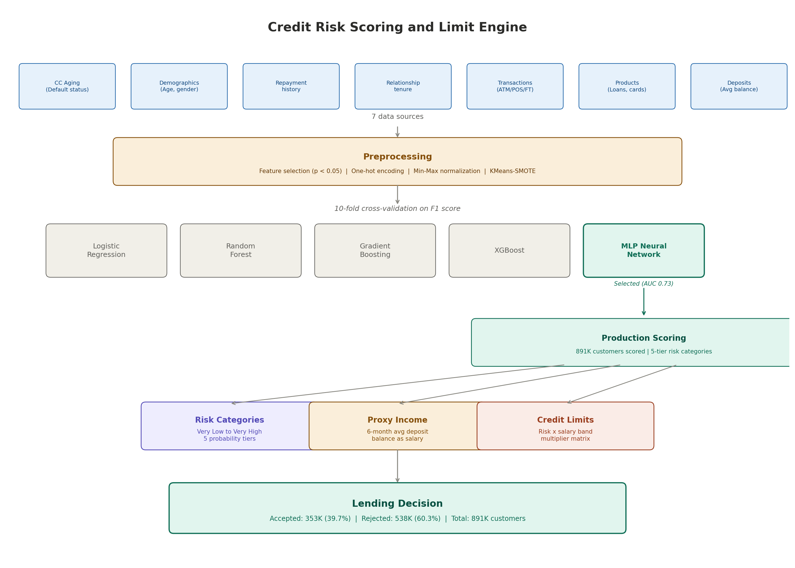

# Credit Risk Scoring and Limit Engine

A machine learning system that predicts credit default probability for 891K existing bank customers, assigns risk categories, estimates proxy income from deposit behavior, and determines credit limits using a risk x salary band multiplier matrix. Built to automate customer eligibility decisions for the bank's digital lending products.

**Industry:** Commercial Banking (Pakistan)  
**Role:** Assistant Manager - Data Science | Designed and built the model end-to-end, from data integration to production scoring  
**Tools:** Python, Scikit-learn, XGBoost, Pandas, SQL Server  
**Scored Population:** 891,136 existing-to-bank (ETB) customers  

---



## Problem

The bank was launching digital lending products (starting with Running Finance) and needed to assess the creditworthiness of its existing customer base. The traditional approach would require manual credit assessment for each applicant, which doesn't scale to nearly 1 million customers.

The challenge was to build an automated system that could take the bank's internal data (credit card history, deposit behavior, transaction patterns, product holdings) and output a credit decision: should this customer be offered a digital loan, and if so, how much?

This required solving three connected problems: predicting who will default, estimating income for customers without salary data on file, and determining appropriate credit limits based on both risk and income.

## Data Sources

The model integrates data from 7 internal sources, creating a 360-degree view of each customer:

| Source | What it provides |
|--------|-----------------|
| Customer aging (CC portfolio) | Default status (30+ days past due definition) |
| Customer demographics | Age, gender, address type, account opening date |
| CC repayment history | Payment behavior and delinquency patterns |
| Customer-bank relationship | Relationship tenure, banking group (Conventional/Islamic) |
| Fund transfer data | Daily/weekly/monthly FT volumes and amounts |
| Product holdings | Loans, credit cards, insurance, internet banking, SMS facility |
| Deposit accounts | Current/savings account balances, average monthly balances |

## Approach

### Feature Engineering

Starting from 80+ raw features across the 7 data sources, features were selected using Pearson correlation with the target variable and p-value significance testing at a 5% threshold. This recursive elimination process reduced the feature set to 35 statistically significant predictors.

The features fall into several categories:

**Customer profile:** banking group, product type, address type, gender, age, relationship tenure, account opening age

**Account holdings:** current accounts, savings accounts, active/inactive credit cards, number of loans, insurance policies, internet banking enrollment, SMS facility

**Transaction behavior (multi-granularity):** ATM withdrawal amounts (daily/weekly/monthly), POS transaction frequency, utility bill payment amounts and counts, credit card bill payment amounts, fund transfer amounts and counts - all computed at daily, weekly, and monthly aggregation levels

**Balance indicators:** 5-month average balance, average deposit balance, credit card customer limit

### Data Preprocessing Pipeline

**Feature encoding:** Categorical features (banking group, product type, address type, gender) were converted to numeric using one-hot encoding, since the neural network requires all-numeric input.

**Normalization:** All features were scaled to [0, 1] using Min-Max normalization. This is critical for neural networks where features with larger magnitudes would dominate the gradient updates.

**Class imbalance handling:** The raw data had a 97.5% / 2.5% split between non-defaulters and defaulters. This extreme imbalance would cause the model to simply predict "non-defaulter" for everyone and still achieve 97.5% accuracy. The solution was KMeans-SMOTE (Synthetic Minority Over-sampling Technique with KMeans clustering), which generates synthetic defaulter samples by interpolating between existing defaulters in feature space. This brought the training distribution to 50/50.

### Model Selection

Five algorithms were benchmarked with 10-fold cross-validation on the F1 score:

| Algorithm | Purpose in evaluation |
|-----------|----------------------|
| Logistic Regression | Baseline, interpretable coefficients |
| Random Forest (1000 trees) | Ensemble bagging method |
| Gradient Boosting | Sequential ensemble |
| XGBoost | Optimized gradient boosting |
| MLP Neural Network (25, 5) | Non-linear pattern capture |

The MLP Neural Network was selected as the production model based on the best balance of accuracy and discrimination (AUC = 0.73). The network architecture uses two hidden layers (25 neurons, then 5 neurons) with Adam optimizer.

### Proxy Income Estimation

Many customers don't have salary information on file. For these customers, the model estimates proxy income by averaging their month-end deposit balance over the past 6 months. This is queried directly from the bank's deposit system:

```sql
SELECT ACCOUNT_NUM, avg(Avg_Bal) as est_salary
FROM customer_deposits
WHERE Month_deposit >= DateAdd(month, -6, ...)
GROUP BY ACCOUNT_NUM
```

### Limit Determination Engine

The final credit limit is computed as: `limit = proxy_income x multiplier`

The multiplier is a lookup from a risk x salary band matrix defined by the Digital Lending team:

| Salary Band (PKR '000) | Low-Medium Risk (< 0.6) | High Risk (0.6 - 0.8) | Very High Risk (> 0.8) |
|------------------------|------------------------:|----------------------:|----------------------:|
| 20 - 30 | 1.5x | 0.5x | 0x |
| 30 - 40 | 1.5x | 0.5x | 0x |
| 40 - 50 | 2.0x | 1.0x | 0.5x |
| 50 - 60 | 2.0x | 1.0x | 0.5x |
| 60 - 70 | 2.5x | 1.0x | 0.5x |
| 70 - 80 | 3.0x | 1.0x | 0.5x |
| 80 - 90 | 4.0x | 1.0x | 0.5x |
| 90 - 100 | 4.0x | 1.0x | 0.5x |
| 100+ | 5.0x | 1.0x | 0.5x |

This matrix means a low-risk customer earning PKR 80K gets a limit of PKR 320K (4x), while a high-risk customer at the same salary gets PKR 80K (1x), and a very high-risk customer in the lowest salary band gets zero.

## Results

### Model Performance

| Metric | Value |
|--------|------:|
| Accuracy | 73% |
| AUC (ROC) | 0.73 |
| Precision (non-defaulter) | 0.7548 |
| Recall (non-defaulter) | 0.6899 |
| Precision (defaulter) | 0.7171 |
| Recall (defaulter) | 0.7782 |
| F1 (weighted avg) | 0.7337 |

### Risk Distribution (891K customers)

| Risk Category | Customers | Share | Avg Default Probability |
|--------------|----------:|------:|------------------------:|
| Very Low | 293,903 | 32.98% | 0.075 |
| Low | 122,254 | 13.72% | 0.294 |
| Medium | 124,673 | 13.99% | 0.505 |
| High | 175,238 | 19.66% | 0.706 |
| Very High | 175,068 | 19.65% | 0.881 |

### Final Lending Decision

After applying the proxy income and limit determination criteria:

| Decision | Customers |
|----------|----------:|
| Accepted | 353,465 |
| Rejected | 537,671 |
| **Total** | **891,136** |

39.7% of the existing customer base was deemed eligible for digital lending products.

## Validation Design

The dataset was split 70/30 (train/test) with a fixed random seed for reproducibility. KMeans-SMOTE oversampling was applied only to the training set to prevent data leakage - the test set retained the original class distribution.

**Key validation choices:**
- Oversampling applied to training data only, not test data. This prevents synthetic samples from leaking into evaluation.
- 10-fold cross-validation was used for model comparison across all 5 algorithms, ensuring the MLP selection wasn't due to a lucky split.
- The confusion matrix was evaluated on the original (non-oversampled) test set to reflect real-world class proportions.
- Default definition: any customer who has fallen into 30+ days past due (30dpd) on their credit card. This is a standard banking industry threshold.

**Assumptions:**
- Credit card aging is a reliable proxy for default risk on new digital lending products. Customers who default on credit cards are assumed to carry similar risk for running finance.
- 6-month average deposit balance is a reasonable proxy for monthly income. This assumption holds for salaried customers with regular deposits but may overestimate income for customers with lumpy or seasonal deposits.
- The existing customer base is representative of future digital lending applicants. This holds for ETB customers but breaks for new-to-bank (NTB) customers who would need a different model.

## Limitations and What I Would Test Next

**Known limitations:**
- 73% accuracy is acceptable for a first-generation model but leaves room for improvement. The main bottleneck is that credit card behavior may not perfectly predict running finance behavior since the products have different risk profiles.
- SMOTE generates synthetic samples by interpolating in feature space, which can create unrealistic feature combinations (e.g. a customer with very high salary but zero banking products). KMeans-SMOTE mitigates this somewhat by clustering first, but the issue persists.
- The model only works for ETB customers with credit card history. New customers or customers without credit cards need a separate assessment path.
- The proxy income estimate (6-month avg deposit balance) can be noisy. Customers who receive large one-time transfers or have business accounts mixed with personal accounts get inflated income estimates.
- The limit multiplier matrix is static and defined by business policy, not optimized by the model. A data-driven approach to multiplier calibration could improve outcomes.

**What I would test next:**
- Time-based validation: train on older data, test on newer data to simulate real deployment. The current random split may overstate accuracy if customer behavior changes over time.
- Feature importance analysis to understand which of the 35 features drive predictions most. This would help focus data quality efforts and provide interpretability for credit committees.
- Gradient Boosting with hyperparameter tuning - the XGBoost implementation used in benchmarking had minimal tuning (learning_rate=0.1, max_depth=5) and may outperform MLP with proper optimization.
- A two-stage model: first predict default, then predict loss given default (LGD). The current model treats all defaults equally, but a customer who misses one payment and recovers is very different from one who writes off entirely.
- Reject inference: the model is trained only on customers who were given credit cards. Customers who were never given cards are excluded, which creates selection bias.

## Key Learnings

1. **Class imbalance is the real challenge, not model complexity.** With 97.5/2.5 split, even a constant predictor gets 97.5% accuracy. KMeans-SMOTE was essential - regular SMOTE alone created synthetic samples in sparse regions that confused the classifier.

2. **Multi-granularity transaction features add signal.** Computing ATM, POS, and transfer metrics at daily, weekly, and monthly levels captures different behavioral patterns. Weekly POS frequency was significant while daily was not - customers who transact regularly (weekly pattern) are lower risk than those with sporadic large transactions.

3. **The model is only half the system.** Predicting default probability is necessary but not sufficient. The proxy income estimation and limit determination engine convert a probability into an actionable credit decision. Without the business logic layer, the ML model has no operational value.

4. **Neural networks need more data to shine.** At 891K customers with only 2.5% positive class, even after oversampling the effective signal is limited. The MLP marginally outperformed logistic regression, suggesting that for this data size and feature set, simpler models with better feature engineering might have been equally effective.

5. **Production serialization matters.** Using joblib to serialize the trained model, scaler, and label encoder meant the scoring pipeline could run independently of the training code. This separation made it possible to score the full 891K customer base without retraining.

## Repository Structure

```
README.md
src/
  feature_engineering.py          # Feature selection, encoding, normalization pipeline
  model_training.py               # Model benchmarking, MLP training, cross-validation
  model_comparison.py             # 5-algorithm comparison with cross-validation
  production_scoring.py           # Score full customer base, risk categorization
  limit_determination.py          # Proxy income estimation and credit limit assignment
notebooks/
  methodology_walkthrough.ipynb   # Step-by-step methodology explanation
config/
  model_config.yaml               # Hyperparameters, risk bands, salary multipliers
diagrams/
  architecture.png                # System architecture diagram
requirements.txt
.gitignore
```

## How to Run

```bash
pip install -r requirements.txt

# Step 1: Feature engineering and preprocessing
python src/feature_engineering.py

# Step 2: Train and compare models
python src/model_training.py

# Step 3: Score production population and determine limits
python src/production_scoring.py
```

> **Note:** This repository contains the complete modeling methodology and production code. Customer data is excluded due to banking confidentiality. The code expects input CSVs with the column schema documented in the config file and a SQL Server connection for deposit balance queries.
